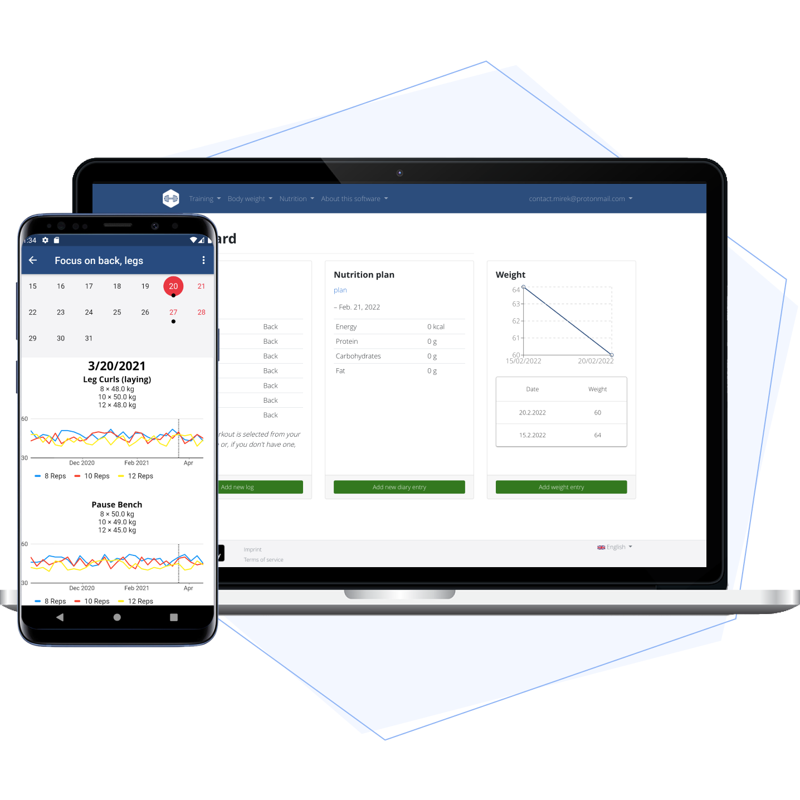

# Wger CI/CD pipeline

Deploy Wger server with CI/CD on Elestio

 
 

# Once deployed ...

You can open Wger here:

    URL: https://[CI_CD_DOMAIN]/admin
    email: admin
    password: [ADMIN_PASSWORD]

You can open pgAdmin here:

    URL: https://[CI_CD_DOMAIN]:50371
    email: [ADMIN_EMAIL]
    password: [ADMIN_PASSWORD]
